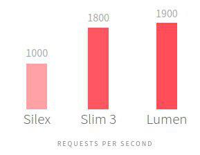
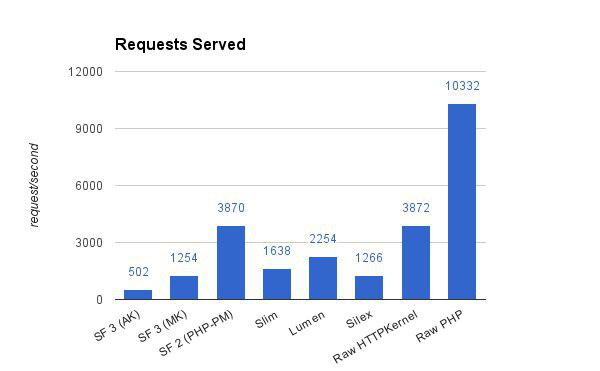
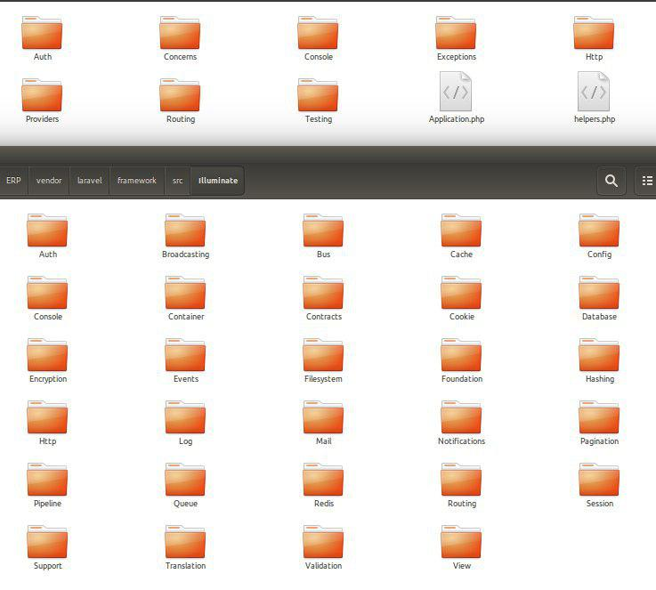

<h1 align="center">Lumen 5.5 Lanjutan - Route dan Manual CORS Middleware</h1>

<p align="center">
    Kulgram Lumen kedua dengan versi 5.5, mengenai penjelasan tentang route, API Versioning, dan membuat CORS Middleware secara manual (tanpa package)
</p>


# Daftar Isi

1. Why Lumen??
2. Instalasi
3. Config dasar (bootstrap/app.php)
4. Composer hanya untuk migration.
5. Penjelasan Route di Lumen (tidak ada resourceth route)
6. Penjelasan API Versioning
7. Manual CORS Middleware 

<hr>

Assalamualaikum warahmatullahi wabarakatuh

Sebelum memulai kulgram, perkenalkan saya Nusendra Hanggarawan. Sebagai catatan disini saya mau share saja, karena saya juga masih sangat awal dalam bahasa ini. Selain itu, saya tidak pintar dalam pemilihan bahasa, kekayaan bahasa saya dapet nilai C wkwk. Jadi nanti kalau ada salah kata atau kekeliruan, mohon dimaklumi 😊

Bagi yang udah pinter, tolong saya jangan di bully ya ehehe. Semoga materi yang saya share berguna buat temen - temen semua. Aamiiinn

Oke, bahasan pertama saya akan bahas sekilas tentang Lumen. Apa sih Lumen? Lumen adalah microframework yang khusus menangani API service, sama seperti Slim dan Silex.

Lumen ini juga bisa dikatakan sebagai adik kecil nya laravel, jadi kalian inshallah pasti langsung paham dengan struktur dan cara mengimplementasikan Lumen.

### Why Lumen ??

Sebelum menentukan framework PHP yang akan kita pakai, kita sebaiknya tentukan dulu teknologi dan sistem seperti apa yang akan kita bangun.

1. Jika web sederhana yang tanpa banyak melibatkan frontend framework JS misalnya, kita gunakan saja Laravel. Pakai Laravel dengan dipadukan frontend JS juga bisa, misalnya saja Vuejs yang udah include di fresh instalasi nya laravel.
2. Jika web yang membedakan repository project, misalkan untuk backend pakai php, sedangkan frontend pakai full JS maka kita perlu yang namanya API. Bisa juga sih API kita pakai Laravel, tapi sangat tidak disarankan untuk memakai Laravel kalau hanya untuk kebutuhan API saja karena Laravel mempunyai banyak fitur, yang mana nantinya fitur fitur ini tidak terpakai karena kita hanya memanfaatkan API nya saja. So, kita perlu framework yang khusus untuk API (spesialis).

Nah kenapa harus lumen? Kenapa bukan yang lain misalnya Silex / Slim / Phalcon ?? Sah sah saja kalau mau pakai selain lumen, tapi berdasarkan benchmark, Lumen lebih mantap daripada Slim. (Benchmark ya, bukan vote). Ya paling tidak Lumen vs Slim 11 - 12 lah. Hampir sama
#CMIIW



https://www.gajotres.net/best-available-php-restful-micro-frameworks/

Karena disini yang di rekomendasikan adalah Slim, Lumen, Silex, Phalcon. Maka benchmark nya dibawah ini
https://symfony.fi/entry/symfony-benchmarks-microkernel-silex-lumen-and-slim



OK, insyaallah kita ga salah pilih kalo pake lumen 😊

### Instalasi

Untuk instalasi, gak perlu saya jelaskan panjang lebar. Hampir sama dengan instalasi laravel / lumen yang udah di bahas di kulgram sebelumnya

### Config Dasar

pada lumen fresh install, dia bener bener ringan. tapi jika kita pengen pake kekuatan yang ada di laravel (seperti eloquent, facades, middleware, dll) untuk dipakai di lumen, kita harus mengaktifkan nya di file bootstrap/app.php, karena secara default fitur fitur tersebut di non aktifkan.

Nah, caranya kita tinggal uncomment baris kode yang ada di bootstrap/app.php

Uncomment
`$app->withFacades();`
<br>untuk mengaktifkan fitur facade (sangat disarankan)

Uncomment
`$app->withEloquent();`
<br>untuk mengaktifkan fitur eloquent (Optional)

Uncomment
```
$app->routeMiddleware([
    'auth' => App\Http\Middleware\Authenticate::class,
]);
```
<br>untuk mengaktifkan middleware di route (untuk auth)

uncomment 2 baris ini
```
$app->register(App\Providers\AppServiceProvider::class);
$app->register(App\Providers\AuthServiceProvider::class);
```
Config done .....

### Composer : Laravel vs Lumen

Ketika temen - temen mengetik
`php artisan`
<br>di terminal, pada laravel akan muncul banyak opsi, sebaliknya di lumen kalian hanya akan menemukan sedikit. karena lumen ini lebih banyak menggunakan teknik manual daripada otomatisasi seperti di laravel. Jika di laravel kita bisa bikin model dan controller lewat artisan, di lumen kita ga bisa melakukan hal tersebut. So, di lumen kita harus create file nya secara manual.

### Penjelasan Route di Lumen

di Laravel, kita bisa mengetikkan route seperti ini
`Route::get('post','PostController@index');`
<br>atau dengan resource
`Route::resource('post','PostController');`

tapi di Lumen 5.5 berbeda, seperti dibawah ini
`$router->get('post','PostController@index');`

dan satu lagi, di lumen kita ga bisa pakai fitur resource..

### API Versioning di Lumen

Saya dulu gak paham dengan api versioning ini, sampe tanya mas @mai92 juga masih belum solved. Kebingungan ini merasuk ke dalam jiwa #lol ketika mencari perbedaan antara URI localhost/api/v1/post dengan localhost/post. Karena keduanya sama aja di response nya, gak ada perbedaan sama sekali. Lantas apa gunanya api version? akhirnya googling sendiri dan nemu artikel ini 
https://dzone.com/articles/rest-api-versioning-is-there-a-right-answer

Jadi ada 2 kondisi :
- Jika api yang dibangun hanya untuk kebutuhan internal, maka kita tidak perlu api versioning
- Jika api kita merupakan public API yang mana kita gak bisa mengontroll di sisi client, maka kita perlu melakukan api versioning. jadi misalkan di api v1 kita memberi response dengan struktur json tertentu, kemudian di sisi backend kita ada perubahan struktur json, maka kita harus bikin api v2 dan menginformasikan ke client bahwa kita update api ke versi 2. Sehingga client bisa menyesuaikan app nya dengan struktur response json yang baru milik kita.

Sampai sini pengenalan awal nya sudah beres. Insyaallah paham lah ya. Dasar banget ini soalnya. Gak jauh beda sama Laravel. Bedanya kita lebih banyak bermain di manual

Sebelum menginjak ke point akhir, silakan kalau temen - temen ada yang mau nambahin / bertanya

<blockquote>Lock On Stratos, [31.12.17 19:49]
jadi kalo buat public API v1,v2. termasuknya wajib ya bang ?</blockquote>

iya. Jika kita merasa kedepannya bakal ada perubahan struktur json untuk response kita, maka perlu dibuat api version. Tapi kalau misalnya response kita tidak ingin ada perubahan, dan selama nya tetap seperti itu struktur nya, maka tanpa dibuat versi juga tidak masalah

dan jika api kita hanya untuk kebutuhan internal, tanpa versioning API juga ga masalah. Karena di sisi client / frontend kita sendiri yang pegang. Jika ada perubahan json, langsung kita ubah disisi frontend nya

<blockquote>Noor Adiana, [31.12.17 19:51]
Secara default component laravel apa aja yang dibawa oleh lumen?</blockquote>



<blockquote>Lock On Stratos, [31.12.17 19:53]
Kalo udah di update jadi v2.. untuk yang v1 nya tetep bisa di gunakan ya bang ?</blockquote>

ini tergantung. jika kita pengen mempertahankan v1 ya boleh saja. Tinggal kita atur di route dan controller nya. Jika pengen menutup v1 juga boleh. Jadi nanti client dipaksa untuk pakai v2.

### CORS Middleware (Optional)

Kalau kita pake frontend vuejs, kita perlu setting CORS di lumen agar request dari HTTP client seperti axios / vue-resource / superagent bisa diterima oleh lumen. Jika kita belum setting CORS di lumen, nanti ketika ada request dari client (vuejs) akan muncul error seperti dibawah ini.


Untuk setting CORS di middleware ada banyak cara. bisa pakai package yang bertebaran di github. Tapi saya lebih seneng bikin sendiri.

Pertama kita bikin CORS Middleware nya dulu. Buat CorsMiddleware.php didalam
`app/Http/Middleware</code>`

Trus copas ini
```
<?php

namespace App\Http\Middleware;

use Closure;

class CorsMiddleware
{
    public function handle($request, Closure $next)
    {
    if($request->isMethod('OPTIONS')) {
      $response = response('', 200);
    } else {
      $response = $next($request);
    }

    $response->header('Access-Control-Allow-Methods', 'HEAD, GET, POST, PUT, PATCH, DELETE');
    $response->header('Access-Control-Allow-Headers', $request->header('Access-Control-Request-Headers'));
    $response->header('Access-Control-Allow-Origin', '*');

    return $response;
  }
}
</code>
<br>
Trus di `bootstrap/app.php</code> edit settingan / uncomment dan tambahkan middleware nya jadi begini

`
$app->middleware([
   App\Http\Middleware\CorsMiddleware::class
]);
```
<br>


Login setelah CORS middleware setelah selesai di setting di backend. api key akan di store ke localstorage dan vuex. Next insyaallah bahas otentikasi ini 😊

Sekian kulgram pembahasan Lumen ini. Maaf ya, judul nya Lumen Vue, tapi belum ada Vue nya. Ini masih awal pengenalan, insyaallah next pakai vue di sisi client / frontend

terima kasih mas @ammarfaizi2 @XsetsugaX @mai92 @nooradiana @Shiyinq @undefined_zain yang udah partisipasi di kulgram kali ini. Mohon maaf kalau ada salah kata, karena saya gak pandai menyusun kata kata.

Wassalamualaikum warahmatulli wabarakatuh
